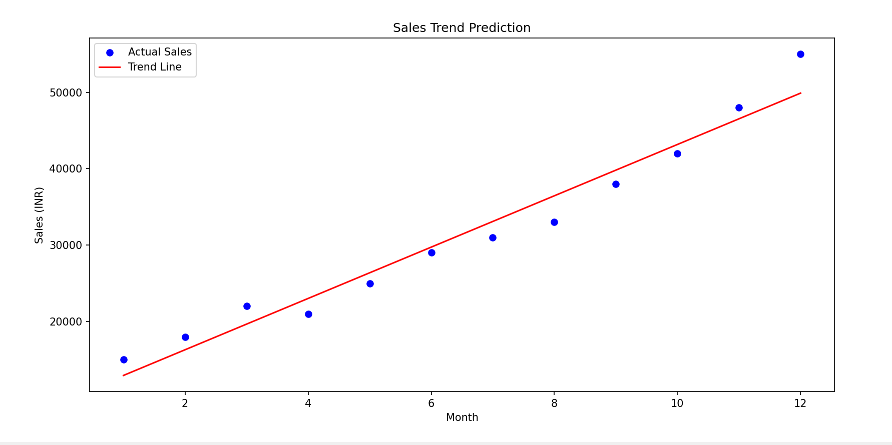

# Hi, I'm Thahir Hussain Muhammed 👋
### Data Science & Java Developer | Kochi, India

Welcome to my portfolio! I specialize in turning raw data into business insights using Python and Java.

---

## 🚀 Projects

### 📈 1. Sales Trend Prediction
**Problem:** Businesses need to know future sales to manage inventory. 
**Solution:** I built a Linear Regression model that analyzes monthly sales data to predict future trends.

#### Result:

#### Tech Used:
- **Language:** Python
- **Libraries:** Pandas (Data Handling), Scikit-Learn (Machine Learning), Matplotlib (Visualization)
- [View Source Code](./predict_sales.py)

### 2. Customer Segmentation (Upcoming)
- **Goal:** Grouping customers by buying behavior using RFM analysis.
- **Tech:** Python, K-Means Clustering.
- [View Project Here](link-to-folder)

---

## 🛠 Skills
- **Languages:** Java, Python, SQL
- **Tools:** VS Code, IntelliJ IDEA, Git/GitHub
- **Focus:** Data Cleaning, Machine Learning, OOP
